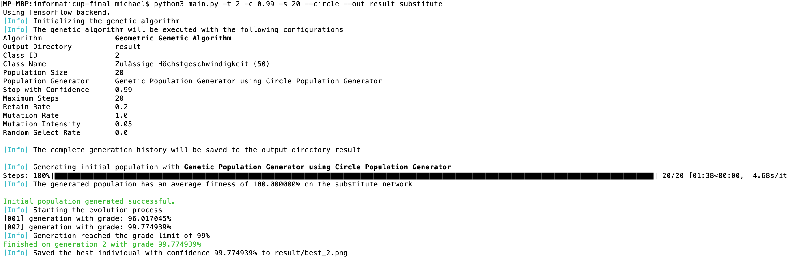

# Genetic Algorithm for a Query Efficient Input-free Black-box Attack against a Neural Network with Limited Information

Previous work has shown that neural networks can be fooled by adversarial images. As part of the informaticup competition, we investigate a black box attack scenario where only limited query access (60 queries per minute) and partial output (top five classes) is given. This tool implements a genetic algorithm, which is capable of generating adversarial images which fool the target network.

## Getting Started

These instructions will get you a copy of the project up and running on your local machine for development and testing purposes.

### Prerequisites

What things you need to install the software and how to install them:

* Python version `>= 3.5`
* Install packages with `pip install -r requirements.txt`


Depending on your configuration you might have to replace the `python` command with `python3`. You can check if `python` executes the correct version with the following command

```
$ python --version
Python 3.5.x
```

To change the `python` command you can place an alias into `~/.bashrc` or `~/.bash_aliases` files

```
alias python=python3
```
## Examples

The following command will compute an image for the target class with the id 2. The genetic algorithm will use the substitute network results as its initial population. The substitute network will use a random circle generator as its initial population. The genetic algorithm will terminate after 20 steps and save its output to the `result` directory.

```
python main.py -t 2 -s 20 --circle --out result substitute
```

The same command can be executed with a confidence limit. The genetic algorithm will terminate when the confidence limit of 99% is reached.

```
python main.py -t 2 -c 0.99 -s 20 --circle --out result substitute
```

What follows is an example output of the command above.



You can use the target class name instead of the class id like follows.
```
python main.py -t "Zulässige Höchstgeschwindigkeit (30)" --rand
```

Note that using `--rand` population generator will most likely not result in high confidence results. Try adding `substitute` to initially compute a good population on the substitute network.

```
python main.py -t "Zulässige Höchstgeschwindigkeit (30)" --rand substitute
```
We suggest the user to use the substitute network and run the algorithm with the standard parameters. You can change arguments like the mutation intensity afterwards. In general the geometric genetic performs slightly better. You will most likely obtain good results using commands like.

```
python main.py -t 2 --polygon substitute
python main.py -t 3 --circle substitute
python main.py -t 8 --tiles substitute
```

You can always terminate the algorithm by using `cmd + c`. The results you generated so far will be in the defined output directory (or default `tmp/output/`).

## Usage

The program can be executed with the following command `python main.py`. There are several arguments which can be passed to change the behavior of the algorithm.

```
main.py [-h]  -t TARGET
              [-c CONFIDENCE]
              [-s STEPS]
              [--population-size POPULATION_SIZE]
              [--retain-rate RETAIN_RATE]
              [--mutation-rate MUTATION_RATE]
              [--mutation-intensity MUTATION_INTENSITY]
              [--random-select-rate RANDOM_SELECT_RATE]
              [--gtsrb-image-path GTSRB_IMAGE_PATH] [--image IMAGE]
              [-o OUT]
               (--rand | --color | --sample | --brute-force | --circle | --polygon | --image-grid | --single-image | --tiles)
               {substitute} ...
```

When adding the substitute command at the **end** of the arguments, you will have two additional parameters

```
main.py [...] substitute
                [-h]
                [-spn SUBSTITUTE_POPULATION_SIZE]
                [-sps SUBSTITUTE_POPULATION_STEPS]
```

### Arguments

* `-t --target`
The target class name or target class id.
* `-s --steps` The maximum number of steps, i.e. the number of the generations the algorithm will evolve.
* `-c --confidence` The desired confidence. The algorithm will terminate, when the confidence is reached by at least one generated image. If no confidence is provided by the user, the algorithm will run the maximum number of steps. The confidence must be in range [0,1].
* `--population-size` The desired population size. Every generation of the genetic algorithm will have this many individuals.
* `--mutation-rate` The mutation rate which should be used.
* `--mutation-intensity` The mutation intensity which should be used.
* `--random-select-rate` The percentage of individuals which should be randomly added to the next generation.
* `--gtsrb-image-path` The path to the German Traffic Sign Recognition Benchmark. The images of the benchmark are used in some population generators.
* `--image` A path to a .jpg or .jpeg image. The file will be used for the grid image or single image population generators. The background must be black and the foreground should be white.
* `--out` A complete history of all computed generations will be saved to an output directory. If none is provided, a standard directory is chosen.
* What follows are the available population generators. The population generator might have influence on the mutation and crossover function. At least one population generator has to be chosen from the set of possibilities.
  * `--rand` Generates a population of random image individuals.
  * `--color` Generates a population with the same color distribution as some random training images.
  * `--sample` Generates a population, which contains rearrangements of training set images.
  * `--brute-force` Generates a population of random image individuals, while ensuring that each individual's classification contains the target class. To achieve this, new images are generated until the target class is part of the classification.
  * `--circle` Generates population of geometric individuals, which are filled with random circles.
  * `--polygon` Generates a population of geometric individuals which contain random polygons. We restricted the polygons to be triangles.
  * `--image-grid` Generates a population where each individual has 25 copies of the selected image (see `--image`) on a 5x5 grid with different color.
  * `--single-image` Generates a population where each individual has the selected image (see `--image`) in its center. The white portions of the image are then filled with random pixels.
  * `--tiles` Generates a population with geometric individuals. Every individual is completely filled with so called tiles.

If the substitute command was added, the selected population generator will be the initial population generator for the substitute network. The tool will evolve this population to a state where the substitute network classifies the individuals to be most likely in the target class. The `substitute` has to be added **after** the arguments above. If added, the user has two additional arguments.

1. `-spn --substitute-population-size` The population size which should be used by the substitute network. The size has to be larger than `--population-size` *n*, because we want to use the fittest *n* individuals of the substitute network as an initial population of the genetic algorithm. If the variable is not set, we use the size 3*n*.
1. `-sps --substitute-population-steps` Determines the amount of steps (i.e. generations), which should be computed by the genetic algorithm on the substitute network.

### Help

For further help review the help pages
`python main.py -h` and `python main.py substitute -h` or contact us.


## Authors

* **Jonas Dippel** - j.dippel@campus.tu-berlin.de
* **Michael Perk** - m.perk@tu-bs.de

## Additional Information

[InformatiCup Website](https://gi.de/informaticup/)

[Task](https://gi.de/fileadmin/GI/Hauptseite/Aktuelles/Wettbewerbe/InformatiCup/InformatiCup2019-Irrbilder.pdf)
